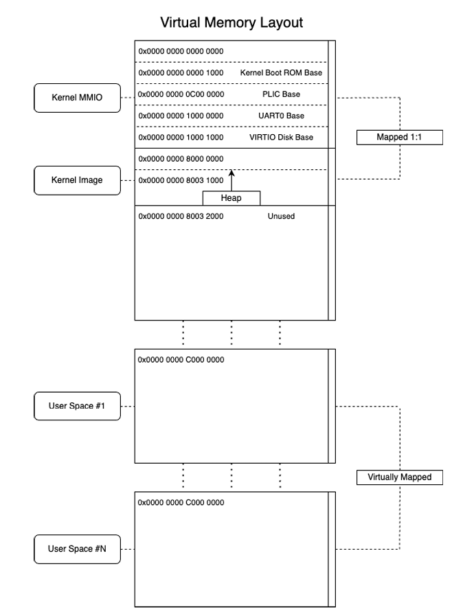
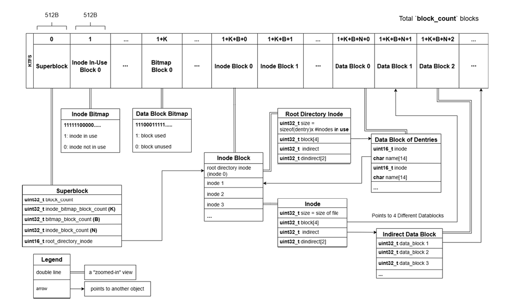
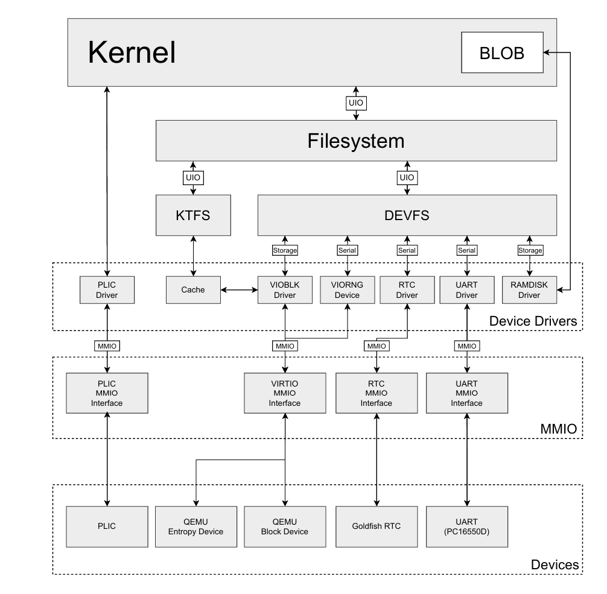

# Architecture

## Process and Virtual Memory

To keep user programs isolated from the kernel and from one another, each process runs in its own Sv39 virtual address space and can request privileged services only through the system call interface. A system call traps into supervisor mode, where the kernel handles the request before restoring the program’s saved state and returning it to user mode. Processes can be duplicated with `fork`, replaced with new programs through `exec`, and synchronized with `wait`, while timer interrupts let the scheduler preempt a running process so multiple programs can share the processor.

  
   
  <em>Course-provided architecture representation of the virtual memory layout.</em>

## Storage and Filesystem

To give user programs persistent access to files, the kernel connects its filesystem to an emulated disk through several storage layers. The VirtIO disk driver submits block requests to the drive and wakes waiting threads when the device signals that an operation is complete. A memory cache keeps recently used blocks in RAM, while KTFS organizes the underlying storage into files using inodes that track each file and where its data is located. As files grow, their inode can reach additional data through indirect blocks of pointers, allowing KTFS to support files much larger than the inode could reference directly.

  
   
  <em>Course-provided architecture representation of the KTFS filesystem layout.</em>

## Uniform I/O

Files, pipes, and device drivers are integrated through a uniform I/O interface, so the rest of the system can interact with them using the same basic operations. Each component handles its own internal behavior, while user programs and the shell do not need separate logic for every source or destination of data. This makes the system easier to extend and lets features such as redirection and piping work naturally across different kinds of I/O.

  
   
  <em>Course-provided architecture representation of the overall kernel structure.</em>

