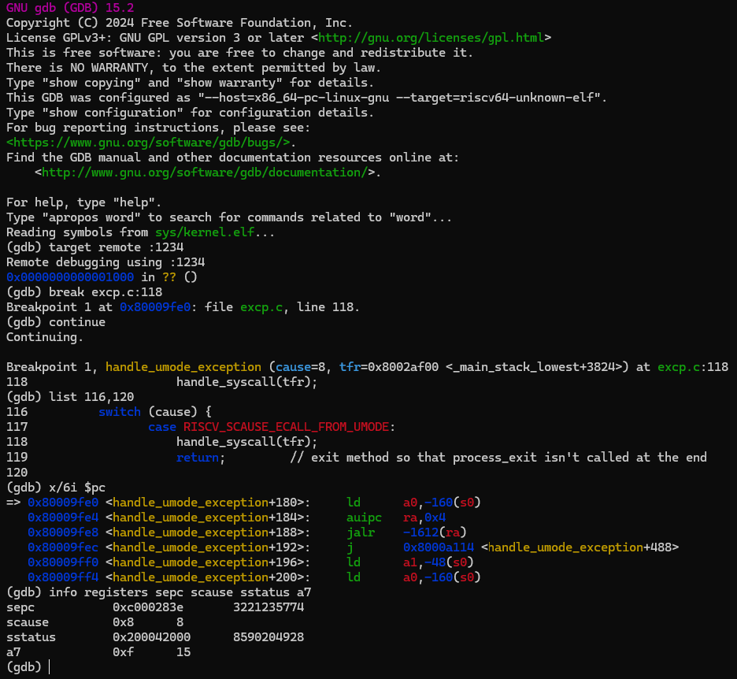

# Verification

Verification used a heavily modified version of the provided test suite. Tests were added and changed so that specific kernel operations could be invoked directly, such as opening a single device driver or launching one user process without first going through the interactive shell. This allowed obvious implementation problems to be corrected along a simple execution path before testing the same functionality as part of the complete kernel under QEMU.

GNU GDB was used alongside QEMU to inspect the trap path during system calls. In the example below, execution is stopped in `handle_umode_exception()` immediately after a user process executes `ecall`. The exception cause is `8`, confirming an environment call from U-mode, and execution can then be followed into `handle_syscall()`. The surrounding RISC-V instructions and supervisor CSRs were inspected at the same breakpoint to verify the processor state saved during trap entry.

  
   
  <em>GDB inspection of the U-mode system call trap path and saved supervisor state.</em>

A fork bug provided one of the clearest uses for this debugging approach. The child process returned from `fork` and resumed execution on its user stack correctly, but the next system call required the kernel to switch back to the child’s kernel stack. Because `sscratch` pointed to the wrong trap-frame location, the trap-entry code looked in the wrong place for the saved context associated with that child’s kernel stack. As a result, the kernel recovered the wrong thread state when the child re-entered supervisor mode. Repeatedly stepping through the trap-entry assembly in GDB traced the failure back to the misplaced trap frame, and correcting that reentry location allowed the child to return to the kernel with the expected thread and process context.
